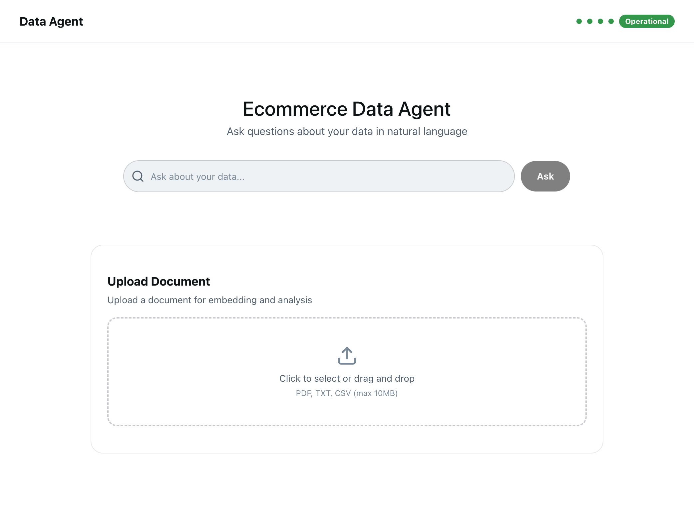
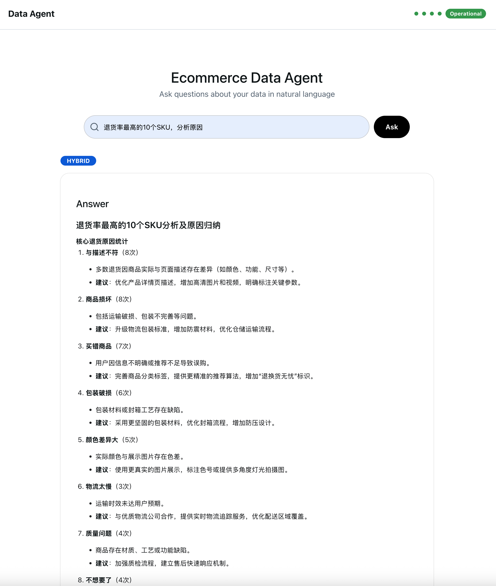
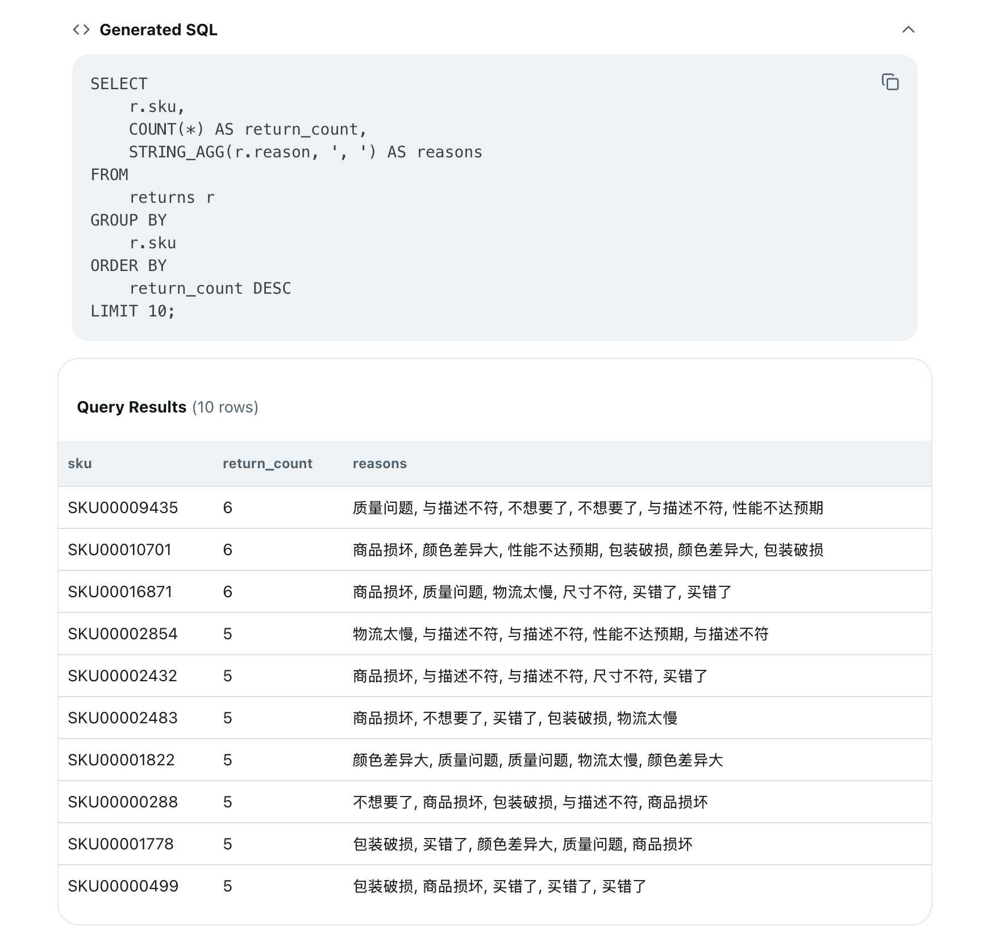
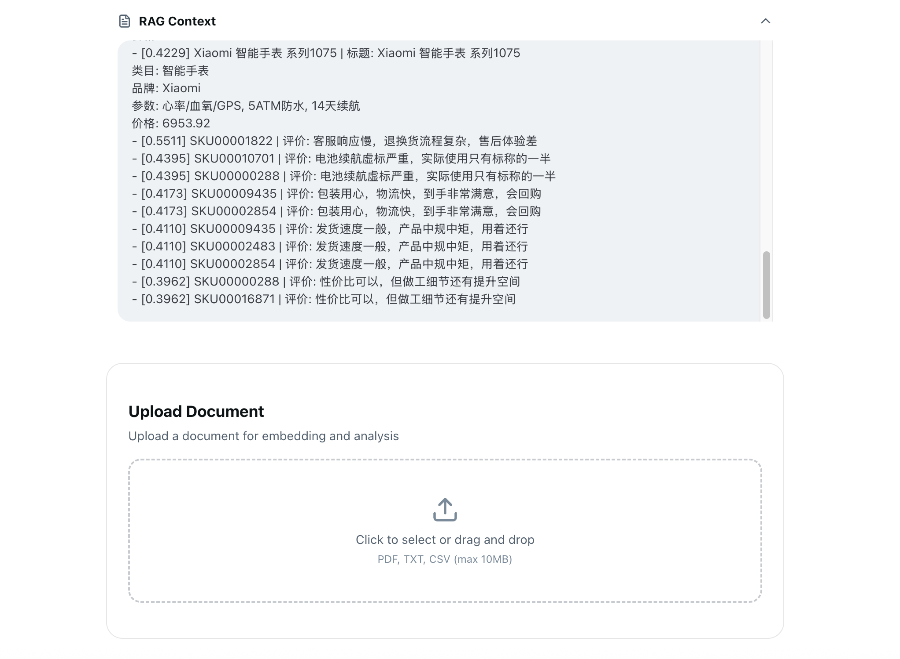
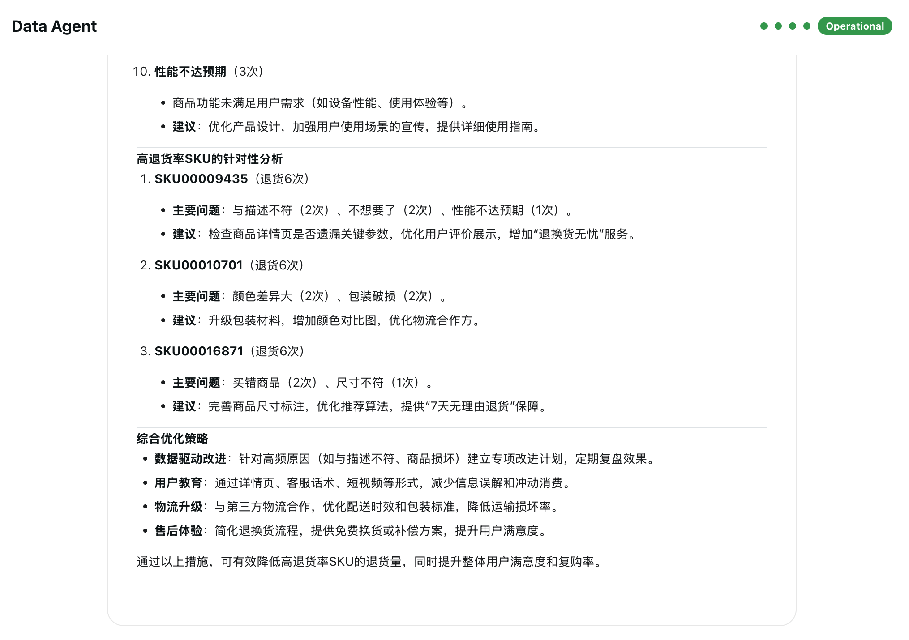
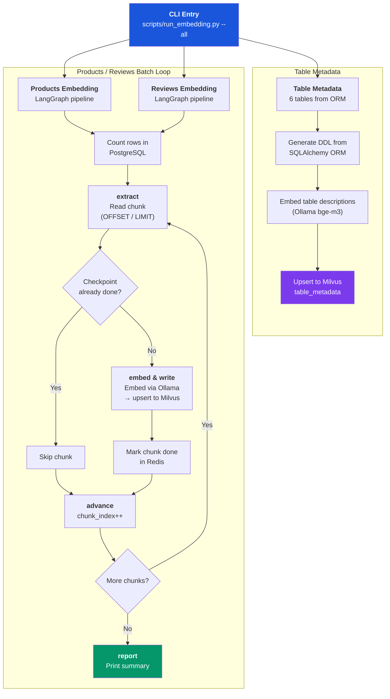
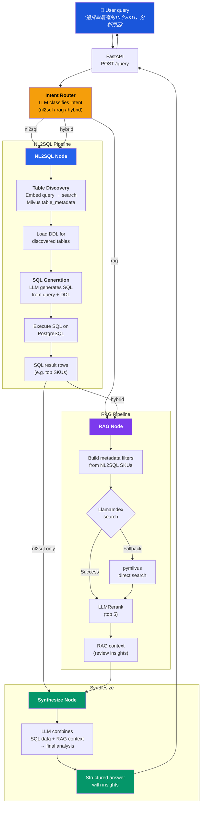

# Ecommerce Agent

Enterprise ecommerce data agent — query business data in natural language, get structured insights combining SQL analytics and review RAG.

## Demo

### 1. Landing Page

The agent's web UI provides a clean search interface for natural language queries and a document upload area for future embedding.



### 2. Ask a Question

Enter a question in natural language. Here we ask "退货率最高的10个SKU，分析原因" (Top 10 SKUs with highest return rates, analyze reasons). The agent classifies this as a **hybrid** intent — it needs both structured SQL data and unstructured review analysis.



### 3. NL2SQL Results

The agent discovers relevant tables, generates SQL, and executes it against PostgreSQL. The collapsible SQL section shows the generated query, and the data table displays the top 10 returned SKUs with return counts and aggregated reasons.



### 4. RAG Context

In hybrid mode, the SKUs from the SQL results are used as metadata filters to search for relevant product info and customer reviews in Milvus. The collapsible RAG section shows retrieved documents with relevance scores.



### 5. Synthesized Answer

The agent combines SQL data and RAG insights into a comprehensive analysis — covering return reason breakdowns, SKU-level root cause analysis, and actionable optimization strategies.



## Quick Start

### Prerequisites

- [Docker](https://docs.docker.com/get-docker/) + Docker Compose
- [uv](https://docs.astral.sh/uv/) (Python package manager)
- [Node.js](https://nodejs.org/) 18+ (for frontend)
- [Ollama](https://ollama.ai/) with models pulled:
  ```bash
  ollama pull bge-m3
  ollama pull qwen3:8b
  ```

### 1. Start infrastructure

```bash
docker compose up -d
```

This starts PostgreSQL, Milvus (with etcd + minio), Redis, and Langfuse.

### 2. Generate simulated data

```bash
cp .env_example .env   # edit if needed
uv sync
uv run python scripts/generate_data.py
```

### 3. Run batch embedding

```bash
uv run python scripts/run_embedding.py --all
```

### 4. Start API server

```bash
uv run uvicorn app.main:app --reload
```

API docs available at http://localhost:8000/docs

### 5. Start frontend

```bash
cd frontend
npm install
npm run dev
```

Open http://localhost:3002

### 6. Query

Use the web UI at http://localhost:3002, or via curl:

```bash
curl -X POST http://localhost:8000/query \
  -H "Content-Type: application/json" \
  -d '{"query": "退货率最高的10个SKU，分析原因"}'
```

## Services

| Service | Port | Purpose |
|---|---|---|
| Next.js Frontend | 3002 | Web UI |
| FastAPI | 8000 | API server |
| PostgreSQL | 5432 | Structured data warehouse |
| Milvus | 19530 | Vector database |
| Attu | 3001 | Milvus GUI |
| Redis | 6379 | Checkpoint / cache |
| Langfuse | 3000 | Observability dashboard |
| Ollama | 11434 | Local LLM + embeddings |

## Verifying Data

After data generation and embedding, verify data in each component:

### PostgreSQL

```bash
docker exec -it ecommerce-agent-postgres-1 psql -U ecommerce -d ecommerce

# Inside psql:
\dt                           # list tables
SELECT COUNT(*) FROM products;
SELECT COUNT(*) FROM reviews;
\q                            # quit
```

### Milvus (via Attu)

Open http://localhost:3001 — browse collections, check row counts, query data visually.

Collections must be loaded into memory to be queryable (done automatically by the embedding pipeline):
- `table_metadata` — 6 table schema records (for NL2SQL table discovery)
- `ecommerce_products` — product embeddings with metadata
- `reviews_sku` — review embeddings with metadata

### Milvus (via CLI)

```bash
# List collections
uv run python -c "
from pymilvus import MilvusClient
c = MilvusClient(uri='http://localhost:19530')
print(c.list_collections())
"

# Query collection
uv run python -c "
from pymilvus import MilvusClient
c = MilvusClient(uri='http://localhost:19530')
c.load_collection('table_metadata')
for r in c.query('table_metadata', output_fields=['table_name','description'], limit=10):
    print(r)
"
```

### Redis

```bash
# Interactive CLI
docker exec -it ecommerce-agent-redis-1 redis-cli

# Inside redis-cli:
KEYS *                        # list all keys
TYPE <key>                    # check key type (string, set, hash, etc.)
SMEMBERS <key>                # get all members of a set (e.g. checkpoint keys)
GET <key>                     # get string value
HGETALL <key>                 # get all fields of a hash
TTL <key>                     # check remaining TTL
```

Or one-liners:
```bash
docker exec ecommerce-agent-redis-1 redis-cli KEYS '*'
docker exec ecommerce-agent-redis-1 redis-cli SMEMBERS 'checkpoint:ecommerce_products:bge-m3:1024'
```

### Langfuse

Open http://localhost:3000 — view LLM traces, agent execution flows, and token usage.

## Project Structure

```
app/                        # Python backend
├── config.py               # Pydantic Settings (all env vars)
├── main.py                 # FastAPI entry point
├── models/                 # DW table ORM + API schemas
├── db/                     # PostgreSQL, Milvus, Redis clients
├── data_generator/         # DDL + simulated data + ingest
├── embedding/              # Batch embedding pipeline (LangGraph)
├── agent/                  # Search agent (intent router + NL2SQL + RAG)
└── api/                    # HTTP routes

frontend/                   # Next.js frontend
├── src/
│   ├── app/                # Next.js App Router pages
│   ├── components/         # UI components (layout, query, results, upload)
│   ├── lib/                # API client, types, utilities
│   └── hooks/              # React hooks (query, health, file upload)
└── .env.local              # Frontend environment config

scripts/                    # CLI entry points
```

## Tech Stack

| Layer | Tool |
|---|---|
| Frontend | Next.js 16 + Tailwind CSS v4 + shadcn/ui |
| Backend API | FastAPI |
| Agent orchestration | LangGraph |
| RAG retrieval | LlamaIndex |
| Structured DW | PostgreSQL |
| Vector DB | Milvus |
| Checkpoint / cache | Redis |
| Observability | Langfuse |
| LLM / Embedding | Ollama (bge-m3 + qwen3:8b) |
| Package management | uv (backend) + npm (frontend) |

## Workflows

### Offline Batch Embedding Pipeline

Prepares vector indexes from structured data so the online agent can perform semantic search.



**Key details:**
- **Table metadata**: Reads ORM definitions → generates DDL → embeds descriptions → upserts 6 records into `table_metadata` collection. Used at query time for NL2SQL table discovery.
- **Products / Reviews**: LangGraph `StateGraph` loops over chunks. Each chunk: read from PostgreSQL → embed batch via Ollama (`bge-m3`) → upsert to Milvus → mark chunk complete in Redis (enables resume on failure).
- **Checkpointing**: Redis stores completed chunk indices per collection + model version. Re-running skips already-processed chunks.

### Online Query Agent Workflow

Handles real-time user queries by combining SQL analytics and RAG.



**Routing logic:**
- **nl2sql**: Intent Router → NL2SQL → Synthesize → END
- **rag**: Intent Router → RAG → Synthesize → END
- **hybrid**: Intent Router → NL2SQL → RAG (with SKU filters from SQL results) → Synthesize → END

**Key details:**
- **Intent Router**: Uses LLM with structured output (`function_calling`) to classify query intent and select relevant Milvus collections.
- **Table Discovery**: Embeds the user query → searches `table_metadata` in Milvus → returns top-k relevant table names → loads their DDL for SQL generation.
- **NL2SQL**: Generates PostgreSQL from natural language using the discovered table DDL as context. Only `SELECT` statements are executed.
- **RAG**: Searches `ecommerce_products` and `reviews_sku` collections. Uses LlamaIndex with `LLMRerank` by default, falls back to pymilvus for complex filter expressions. In hybrid mode, SKUs from NL2SQL results are passed as metadata filters to narrow review search.
- **Synthesize**: LLM merges structured SQL results with unstructured RAG context into a cohesive analysis.
- **Observability**: Every node is traced via Langfuse (`@observe` decorator), capturing LLM calls, token usage, and graph execution flow.

## License

Private
